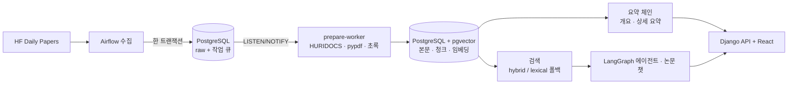

# ArXplore

[](https://github.com/cwj0666/ArXplore/actions/workflows/ci.yml)

Hugging Face Daily Papers의 AI 논문을 매일 수집해 PDF를 파싱·청킹·임베딩하고, **한국어 개요·상세 요약**과 **근거를 인용하는 RAG 챗**으로 읽게 해 주는 논문 탐색 서비스입니다.


<table>
  <tr>
    <td width="50%"><br /><sub><b>AI 어시스턴트</b>: LangGraph 에이전트가 검색하고 논문 링크로 답합니다</sub></td>
    <td width="50%"><br /><sub><b>논문 상세</b>: 한국어 개요·핵심 포인트, 모델을 골라 상세 요약</sub></td>
  </tr>
  <tr>
    <td width="50%"><br /><sub><b>PDF 분할 보기</b>: 원문과 요약을 나란히</sub></td>
    <td width="50%"><br /><sub><b>논문 챗</b>: 그 논문 안을 검색해 답하고 출처 섹션을 표시</sub></td>
  </tr>
</table>

## 한눈에 보기

| | |
| --- | --- |
| **검색** | lexical + vector hybrid. 논문 hit@10 **0.883**, MRR@10 **0.805** (lexical만 쓰던 기존 방식 0.649 / 0.552) |
| **답변 품질** | RAGAS faithfulness 에이전트 **0.865**, 논문 챗 **0.913**. 검색 결과에 없는 링크를 지어낸 답변 **0건** |
| **지연** | 두 검색 채널을 병렬 실행해 검색 p50 **489 → 282ms** (−23.9%) |
| **평가 방식** | 판정 규칙을 먼저 커밋한 뒤 측정(사전 등록). 질의 111개, 교차검증 + 부트스트랩 |
| **스택** | Python 3.12 · Django 5 · React 18 + TypeScript · LangChain / LangGraph · PostgreSQL 16 + pgvector · Airflow 3 |

수치는 논문 275편 코퍼스 기준이고, 측정 조건과 한계는 [평가 문서](./docs/EVALUATION.md)에 있습니다.

## 주요 기능

- **수집**: Airflow가 매일 HF Daily Papers를 PostgreSQL에 저장하고, 같은 트랜잭션에서 처리 작업을 큐에 넣습니다.
- **본문 처리**: PDF를 HURIDOCS(GPU 레이아웃 분석) → pypdf → 초록 순으로 파싱하고, 섹션·역할을 붙여 청킹한 뒤 OpenAI로 임베딩합니다.
- **논문 목록**: 최신순·추천순 정렬, 제목·초록 검색. 페이지·검색어가 URL에 남습니다.
- **논문 상세**: PDF 분할 보기, 한국어 개요·핵심 포인트, 모델(gpt-5-mini / gpt-5)을 골라 생성하는 상세 요약, 관련 논문 카드. AI 결과는 논문 단위로 캐시합니다.
- **논문 챗**: 질문으로 그 논문 안을 검색해 초록 + 발췌 최대 5개로 답하고, 답변의 `[n]` 번호를 출처 카드로 보여 줍니다(SSE 스트리밍, 중지 가능).
- **AI 어시스턴트**: LangGraph ReAct 에이전트가 검색·트렌딩 도구로 답하고, 답변 속 링크를 도구 결과와 대조해 출처를 붙입니다.
- **보호 장치**: 계정 없이 공개로 쓰는 대신 LLM 엔드포인트에 IP당 분당 한도(429 + `Retry-After`)를 둡니다. 서버 키가 없으면 캐시된 결과만 보입니다.

## 아키텍처


```mermaid
flowchart LR
    A[HF Daily Papers] --> B[Airflow 수집]
    B -->|한 트랜잭션| C[(PostgreSQL<br/>raw + 작업 큐)]
    C -->|LISTEN/NOTIFY| D[prepare-worker<br/>HURIDOCS · pypdf · 초록]
    D --> E[(PostgreSQL + pgvector<br/>본문 · 청크 · 임베딩)]
    E --> F[검색<br/>hybrid / lexical 폴백]
    E --> G[요약 체인<br/>개요 · 상세 요약]
    F --> H[LangGraph 에이전트 · 논문 챗]
    G --> I[Django API + React]
    H --> I
```

- **저장소는 PostgreSQL 하나**입니다. raw payload, 작업 큐, 정제 데이터, 벡터, AI 결과 캐시를 모두 담아서, 별도 메시지 브로커 없이 `SKIP LOCKED`와 `LISTEN/NOTIFY`로 큐를 만듭니다.
- **서버는 수집·저장만, GPU 파싱은 로컬 worker가 맡습니다.** 임베딩은 GPU가 아니라 OpenAI API(`text-embedding-3-large`, 1536차원)로 만듭니다.
- **재처리는 멱등합니다.** 낮은 품질의 파싱 결과는 기존 본문을 덮지 않고, 내용이 같으면 청크 id와 임베딩을 보존합니다.

세부 구조, 테이블 스키마, 큐 동작, 기술적 결정은 [ARCHITECTURE.md](./docs/architecture/ARCHITECTURE.md)에 있습니다.

## 검색

| 경로 | 언제 | 방식 |
| --- | --- | --- |
| **hybrid** | 기본값 | lexical·vector 점수를 질의마다 min-max 정규화해 `0.35 × lexical + 0.65 × vector`로 합칩니다. vector 결과가 있으면 lexical의 부분 일치 결과는 뺍니다. |
| **lexical** | 폴백 | 질의 임베딩 호출이 실패하거나 `RETRIEVAL_MODE=lexical`이면 PostgreSQL 전문 검색만 씁니다. |

- **융합 방식을 고른 과정**: 처음에는 근거 기록이 없는 상수 25개짜리 가중 RRF였습니다. 판정 규칙을 먼저 정해 두고 비교했더니 가중치는 111개 질의 중 3개만 바꿨고, 실제 효과는 부분 일치 결과를 거르는 규칙에서 나왔습니다. 이어서 점수 가중합(Bruch 외, ACM TOIS 2023)과 비교해, 예전 규칙보다 나빠지는 질의 없이 3개 질의에서 정답이 2위 → 1위로 오른 이 방식을 채택했습니다(상수 1개).
- **한계**: vector 단독과의 차이(MRR@10 +0.016)는 유의하지 않고, 가중치는 같은 질의셋으로 골랐습니다. 전문 검색이 `english` 설정이라 한국어 질의는 lexical에서 거의 맞지 않습니다.

근거: [평가 문서](./docs/EVALUATION.md), worklog [2026-09-28](./docs/worklog/phase-4/2026-09-28_02_hybrid-융합-상수-재검증-결과와-현재-규칙-유지.md) · [2026-09-29](./docs/worklog/phase-4/2026-09-29_02_convex-combination-융합-비교-결과와-판정.md)

## 평가

| 검색 방식 | hit@1 | hit@10 | MRR@10 |
| --- | --- | --- | --- |
| lexical | 0.514 | 0.649 | 0.552 |
| vector | 0.748 | 0.883 | 0.789 |
| **hybrid** | **0.766** | **0.883** | **0.805** |

| 답변 모드 | faithfulness | answer_relevancy |
| --- | --- | --- |
| 에이전트 | 0.865 | 0.667 |
| 논문 챗 | 0.913 | 0.563 |

- **검색**: 질의 142개 중 정답 논문이 있는 111개(한국어 58 / 영어 53)를 채점했습니다. 질의는 알려진 논문 찾기, 본문 한 청크로만 답할 수 있는 질의, 8개 관점(언어·질의 형태·근거 위치·코퍼스 밖·다논문·안전·대화·상세 챗)의 수작업 케이스로 구성됩니다.
- **답변**: 235개 답변을 RAGAS로 채점했습니다(답변 `gpt-4o`, 판정 `gpt-5-mini`). LLM 없이 세는 행동 지표도 함께 봅니다: 에이전트 거절 정확도 1.000(15건), 지어낸 링크 없음 1.000.

측정 조건, ablation, 약한 부분집합, 재현 명령은 [docs/EVALUATION.md](./docs/EVALUATION.md)에 있습니다.

## Quick Start

원격 서버 없이 로컬 PostgreSQL로 웹 앱을 띄웁니다. 수집은 돌지 않으므로 논문 목록은 빈 상태로 시작합니다.

```bash
cp .env.example .env        # change-me로 시작하는 값(DJANGO_SECRET_KEY, POSTGRES_PASSWORD, OPENAI_API_KEY 등)을 채운다
docker compose --profile local-db up -d postgres-local
python scripts/migrate_schema.py
docker compose --profile local-db up -d --build   # http://localhost
```

```bash
pytest tests/unit                                 # DB·API 키 없이 도는 단위 테스트
cd frontend && npm ci && npm run typecheck && npm run build
```

compose 프로필, 원격 서버 모드, 운영 기본값, 통합 테스트와 CI 구성은 [docs/SETUP.md](./docs/SETUP.md)에 있습니다.

## 알려진 한계

- **평가 규모**: 논문 275편·질의 111개 단일 질의셋이라, 운영 규모의 지연과 지표 분산은 말할 수 없습니다.
- **수식·표**: 평가 코퍼스는 수식·표 파싱을 끄고 만들었습니다. CPU에 묶인 OCR 때문에 논문당 수 분씩 걸려서입니다.
- **한국어 전문 검색**: 임베딩 호출이 실패해 lexical로 내려가면 한국어 질문은 거의 맞지 않습니다.
- **미측정 수정**: 논문 챗 프롬프트 인젝션 수정(ce24d57)의 효과는 아직 재측정하지 않았습니다.
- **배포 전 필요한 것**: TLS, Secure 쿠키, 공유 rate limit용 Redis, SSE용 ASGI 전환, AI 결과 캐시의 프롬프트 버전 관리.

전체 목록과 수치는 [docs/EVALUATION.md](./docs/EVALUATION.md#알려진-한계와-로드맵)에 있습니다.

## 프로젝트 성격과 담당 범위

- **SK네트웍스 AI 캠프 팀 프로젝트**(2026년 3~4월)입니다. 검색 데이터 계층(수집 → 파싱 → 청킹 → 임베딩 → 검색)을 맡아 시작했고, 이후 Django + React 전환(c64a957)과 에이전트 스트리밍 채팅, 관련 논문 카드, compose 통합 등 프로젝트 전체를 주도했습니다.
- **팀원 기여**(git 기록 기준): 논문 상세 문서 기반(`yeseung-Yang`), 한국어 번역·요약 프롬프트(`lucky`).
- **2026년 9월 이후**의 커밋은 포트폴리오 정리를 위한 코드 점검·수정·평가입니다. AI 코딩 도구를 함께 썼고 커밋 트레일러에 표기했습니다.

<details>
<summary>저장소 기록 상세</summary>

팀 프로젝트 종료 시점(143cc72)의 커밋은 41개입니다. git 작성자 이름별로 `cwj0666` 33, `최원준` 3(두 이름 모두 본인), `lucky` 2, `yeseung-Yang` 2, `SKNETWORKS-AICAMP-ADMIN` 1입니다. 작성자 수는 팀원 수와 같지 않고, 커밋으로 남지 않은 기여는 이 숫자에 드러나지 않습니다. 역할 분담 문서는 [ROLES.md](./docs/management/ROLES.md)에 있습니다.

</details>

## 문서

| 문서 | 내용 |
| --- | --- |
| [ARCHITECTURE.md](./docs/architecture/ARCHITECTURE.md) | 런타임 구성, 모듈 경계, 테이블 스키마, 큐 동작, 기술적 결정 |
| [EVALUATION.md](./docs/EVALUATION.md) | 검색·답변 품질, 지연, ablation, 한계와 로드맵 |
| [SETUP.md](./docs/SETUP.md) | 실행 방법, compose 프로필, 운영 기본값, 테스트와 CI |
| [Worklog](./docs/worklog/README.md) | 결정마다의 근거와 트레이드오프. [트러블슈팅 모음](./docs/worklog/TROUBLESHOOTING.md) |
| [eval/README.md](./eval/README.md) | 평가 하니스 사용법과 지표 정의 |
| [AGENTS.md](./docs/architecture/AGENTS.md) | AI 도구 작업 규칙과 공용 계약 |
| [`.env.example`](./.env.example) | 환경 변수 전체 목록 |

<details>
<summary>프로젝트 구조</summary>

```text
backend/            Django 프로젝트 (arxplore_web 설정, papers 앱 API)
frontend/           React + TypeScript + Vite
src/core/           모델, 프롬프트, 요약 그래프, LangGraph 에이전트
src/integrations/   PostgreSQL 저장소(raw·정제·벡터·큐), PDF 파서, 임베딩, 검색
src/pipeline/       수집·prepare·임베딩 진입점과 prepare-worker
src/shared/         설정(Pydantic AppSettings)과 LangSmith 트레이싱
dags/               Airflow DAG 3개
docker/             이미지와 런타임 설정
scripts/            실행 스크립트, 스키마 마이그레이션, 운영 스크립트
tests/              단위 테스트(unit), PostgreSQL 통합 테스트(integration)
docs/               아키텍처·평가·실행 문서, worklog, 팀 운영 문서
```

</details>

## License

팀 프로젝트라서 라이선스는 팀원 동의를 받은 뒤 정합니다. 제안안은 MIT입니다. LICENSE 파일이 추가되기 전까지 저작권은 각 기여자에게 있습니다.
