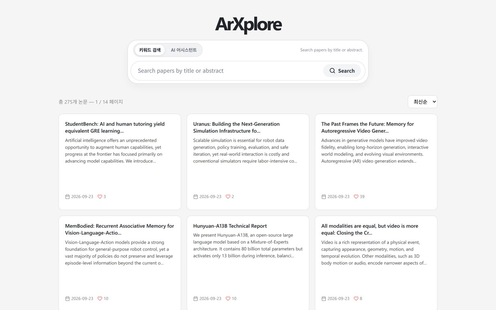
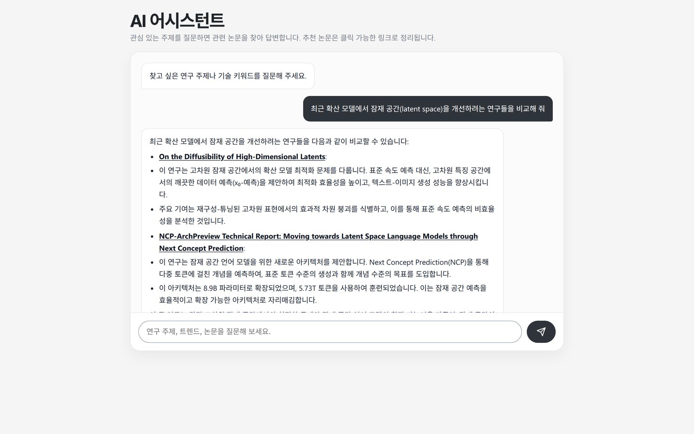
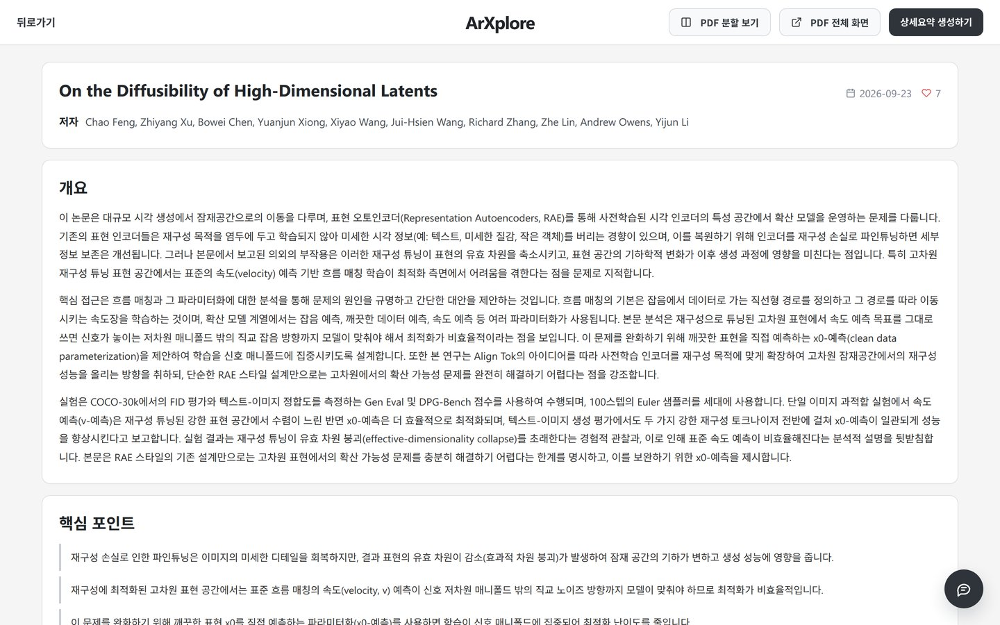
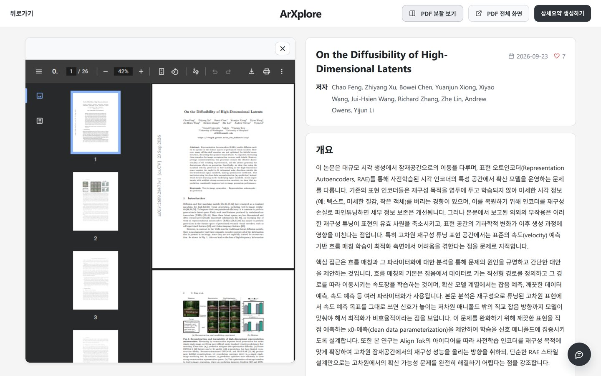
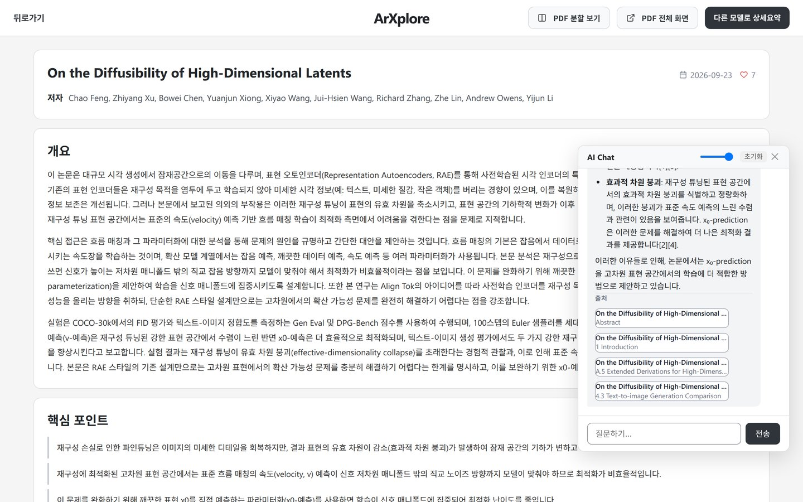
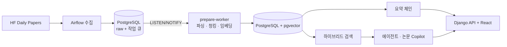

# ArXplore

[](https://github.com/cwj0666/ArXplore/actions/workflows/ci.yml)

Hugging Face Daily Papers의 최신 AI 논문을 매일 수집해 한국어 요약과 근거를 인용하는 RAG 챗으로 읽을 수 있게 만든 논문 탐색 서비스입니다.



<table>
  <tr>
    <td width="50%"><br /><sub><b>AI 어시스턴트</b> · 코퍼스 전체를 검색해 논문 링크와 함께 답변</sub></td>
    <td width="50%"><br /><sub><b>논문 상세</b> · 한국어 개요와 핵심 포인트, 상세 요약</sub></td>
  </tr>
  <tr>
    <td width="50%"><br /><sub><b>PDF 분할 보기</b> · 원문과 요약을 나란히</sub></td>
    <td width="50%"><br /><sub><b>논문 Copilot</b> · 논문 안에서 근거를 찾아 답하고 출처 섹션 표시</sub></td>
  </tr>
</table>

## Features

- **논문 수집 자동화**: Airflow가 매일 HF Daily Papers를 수집하고 처리 작업을 큐에 등록합니다.
- **PDF 처리 파이프라인**: HURIDOCS 레이아웃 분석, pypdf, 초록 순의 3단계 폴백으로 본문을 파싱하고, 섹션 단위로 청킹해 임베딩합니다.
- **한국어 요약**: 논문 개요와 핵심 포인트, 모델을 골라 생성하는 상세 요약을 제공하고 결과를 캐시합니다.
- **논문 Copilot**: 선택한 논문 안에서 근거를 검색해 답하고, 답변의 인용 번호를 출처 섹션과 연결합니다.
- **AI 어시스턴트**: LangGraph ReAct 에이전트가 전체 코퍼스를 검색해 관련 논문 링크와 함께 답합니다.
- **하이브리드 검색**: 전문 검색과 벡터 검색의 점수를 정규화해 가중합으로 합칩니다.
- **스트리밍 UI**: SSE로 답변을 실시간 출력하고, 생성 중에 멈출 수 있습니다.

## Architecture


```mermaid
flowchart LR
    A[HF Daily Papers] --> B[Airflow 수집]
    B --> C[(PostgreSQL<br/>raw + 작업 큐)]
    C -->|LISTEN/NOTIFY| D[prepare-worker<br/>파싱 · 청킹 · 임베딩]
    D --> E[(PostgreSQL + pgvector)]
    E --> F[하이브리드 검색]
    E --> G[요약 체인]
    F --> H[에이전트 · 논문 Copilot]
    G --> I[Django API + React]
    H --> I
```

- PostgreSQL 하나에 원본, 작업 큐, 본문·청크, 벡터, AI 결과 캐시를 모두 두고, 큐는 `SKIP LOCKED`와 `LISTEN/NOTIFY`로 구현했습니다.
- 서버는 수집과 저장을 맡고, GPU가 필요한 PDF 파싱은 로컬 worker가 처리해 서버 DB에 적재합니다.
- 재처리는 멱등하게 동작해 같은 내용이면 청크와 임베딩을 그대로 유지합니다.

## Tech Stack

| 영역 | 기술 |
| --- | --- |
| Backend | Python 3.12, Django 5, gunicorn |
| Frontend | React 18, TypeScript, Vite, TanStack Query |
| LLM · RAG | LangChain, LangGraph, LangSmith, OpenAI API |
| Data | PostgreSQL 16, pgvector, Apache Airflow 3 |
| PDF Parsing | HURIDOCS Layout Parser, pypdf |
| Infra | Docker Compose, nginx, GitHub Actions |

## Evaluation

평가 데이터: 논문 275편, 질의 111개

**검색 품질**

| 검색 방식 | Hit@1 | Hit@10 | MRR@10 |
| --- | --- | --- | --- |
| 전문 검색 | 0.514 | 0.649 | 0.552 |
| 벡터 검색 | 0.748 | 0.883 | 0.789 |
| **하이브리드** | **0.766** | **0.883** | **0.805** |

**답변 품질 (RAGAS)**

| 답변 모드 | Faithfulness | Answer Relevancy |
| --- | --- | --- |
| AI 어시스턴트 | 0.865 | 0.667 |
| 논문 Copilot | 0.913 | 0.563 |

**응답 지연**: 하이브리드 검색 p50 282ms (전문·벡터 검색 병렬 실행)

## Getting Started

```bash
cp .env.example .env    # DJANGO_SECRET_KEY, POSTGRES_PASSWORD, OPENAI_API_KEY 등을 채운다
docker compose --profile local-db up -d postgres-local
python scripts/migrate_schema.py
docker compose --profile local-db up -d --build    # http://localhost
```

```bash
pytest tests/unit
cd frontend && npm ci && npm run typecheck && npm run build
```

## Project Structure

```text
backend/            Django 프로젝트와 API
frontend/           React + TypeScript + Vite
src/core/           프롬프트, 요약 그래프, LangGraph 에이전트
src/integrations/   PostgreSQL 저장소, PDF 파서, 임베딩, 검색
src/pipeline/       수집·파싱·임베딩 진입점과 prepare-worker
src/shared/         설정과 LangSmith 트레이싱
dags/               Airflow DAG
eval/               검색·생성 평가 하니스
docs/               아키텍처, 평가, 실행 문서와 worklog
```

## Documentation

| 문서 | 내용 |
| --- | --- |
| [ARCHITECTURE.md](./docs/architecture/ARCHITECTURE.md) | 런타임 구성, 모듈 구조, 테이블 스키마, 기술적 결정 |
| [EVALUATION.md](./docs/EVALUATION.md) | 검색·답변 품질, 응답 지연, 측정 방법 |
| [SETUP.md](./docs/SETUP.md) | 실행 방법, compose 프로필, 테스트와 CI |
| [Worklog](./docs/worklog/README.md) | 설계 결정 기록과 [트러블슈팅](./docs/worklog/TROUBLESHOOTING.md) |
| [eval/README.md](./eval/README.md) | 평가 하니스 사용법과 지표 정의 |

## Team

SK네트웍스 AI 캠프 팀 프로젝트입니다. 프로젝트 리드로서 수집·파싱·청킹·임베딩·검색 데이터 계층, Django + React 전환, 에이전트 채팅, 평가 체계를 맡았습니다.
