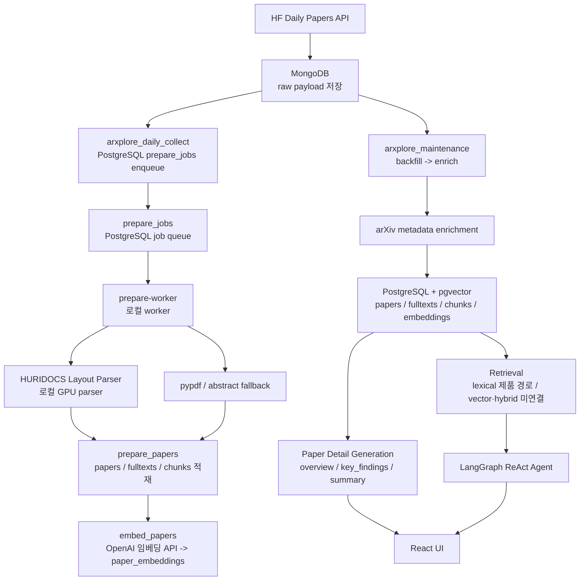
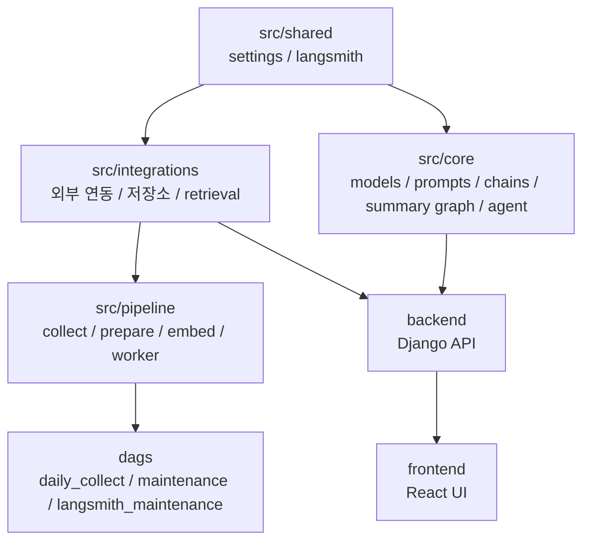

# ArXplore 시스템 아키텍처

## 1. 문서 목적

이 문서는 ArXplore의 현재 운영 구조와 모듈 경계를 코드 기준으로 설명한다. 목표 구조가 아니라 지금 코드가 실제로 하는 일을 적고, 구현만 되어 있고 제품 경로에 연결되지 않은 부분은 따로 표시한다.

ArXplore는 `최신 AI 논문 수집 -> raw 저장 -> prepare queue 등록 -> 로컬 prepare/embedding -> retrieval -> 논문 상세 문서 / 에이전트 응답 -> UI` 흐름을 기준으로 한다. 수집 자동화와 무거운 파싱은 같은 런타임에 있지 않다. 서버 스택은 Airflow와 데이터 저장소를 운영하고, 로컬 PC는 Django/React 서비스, GPU parser, prepare worker를 실행한다.

## 2. 시스템 전경



- 수집 자동화는 서버 Airflow가 수행한다
- prepare와 embed는 로컬 worker가 수행하고, 결과는 서버 DB에 직접 적재한다
- GPU는 HURIDOCS 파서에만 쓴다. 임베딩은 OpenAI API(`text-embedding-3-large`, `dimensions=1536`)로 만든다

즉 "서버가 큐를 만든 뒤 로컬 worker가 이를 소비하는 분리형 구조"다. 서버에 GPU가 없어도 되고, 서버 DB를 공용 저장소로 유지할 수 있어 이 구조를 택했다.

## 3. 런타임 토폴로지

### 서버 런타임

`docker-compose.server.yml` 기준 컨테이너:

- `arxplore-postgres` (pgvector/pgvector:pg16)
- `arxplore-mongo`
- `arxplore-airflow-init`
- `arxplore-airflow-web`
- `arxplore-airflow-scheduler`
- `arxplore-airflow-dag-processor`

PostgreSQL(15432), MongoDB(17017), Airflow(18080) 포트는 `TAILSCALE_SERVER_IP`에만 바인딩한다. Airflow는 SimpleAuthManager 사용자(`AIRFLOW_ADMIN_USER`)로 로그인한다.

서버 Airflow DAG는 3개다. 모두 `start_date`가 `Asia/Seoul`이라 cron은 KST 기준이다.

| DAG | 파일 | 스케줄 | 하는 일 |
| --- | --- | --- | --- |
| `arxplore_daily_collect` | `dags/daily_collect.py` | 매일 18:00 | 최신 HF Daily Papers raw 수집, 날짜를 `prepare_jobs`에 enqueue |
| `arxplore_maintenance` | `dags/maintenance.py` | 3시간마다 | 과거 raw backfill -> arXiv 메타데이터 enrich (backfill이 실패해도 enrich는 수행) |
| `arxplore_langsmith_maintenance` | `dags/langsmith_maintenance.py` | 매일 03:00 | 오래된 LangSmith trace 정리 (기본 14일 초과, `dry_run` 파라미터 지원) |

### 로컬 서비스 런타임

단일 `docker-compose.yml`의 기본 서비스 `arxplore-nginx`, `arxplore-django`, `arxplore-vite`. nginx는 React 빌드를 서빙하고 API를 Django로 프록시한다. Django는 gunicorn(gthread, 워커 4 × 스레드 8)으로 돈다. `arxplore-vite`는 프론트엔드 수정용 Vite dev server다.

원격 서버 없이 웹만 띄울 때는 `local-db` 프로필의 `postgres-local`(pgvector/pgvector:pg16, `127.0.0.1:${SERVER_POSTGRES_PORT:-15432}`)을 함께 올린다. 같은 compose 기본 네트워크에 있으므로 django는 `PROD_POSTGRES_HOST=postgres-local:5432`로 접속한다. 수집 계층이 없으므로 이 모드의 DB는 비어 있다.

### 로컬 parser / worker 런타임

`parser` 프로필이 `arxplore-layout-parser`(HURIDOCS, GPU)와 `arxplore-prepare-worker`를 함께 올린다. `LAYOUT_PARSER_BASE_URL`은 기본값도 자동 감지도 없으므로 `.env`에 `http://layout-parser:5060`처럼 넣는다. 비어 있으면 layout 단계를 건너뛰고 pypdf로 내려간다.

`src/pipeline/prepare_worker.py`가 `prepare_jobs`를 소비하는 공식 진입점이다. 시작할 때 스키마를 1회 확인(`ensure_schema`)한 뒤, `LISTEN/NOTIFY`로 새 잡을 기다리다가 `prepare -> embed`를 수행한다.

## 4. 모듈 구조



### `src/shared`

공용 설정과 tracing. `settings.py`는 MongoDB, PostgreSQL, parser, LangSmith, worker 설정을 로드하고, `host[:port]` 주소를 해석한다(`resolve_host_and_port`). `langsmith.py`는 단계별 trace metadata를 구성한다. 전체 환경 변수 목록은 루트 `.env.example`에 있다.

### `src/integrations`

- `paper_search.py`: HF Daily Papers와 arXiv 메타데이터 조회, 관련 논문 카드의 arXiv 외부 검색
- `raw_store.py`: MongoDB raw payload와 수집 상태 저장
- `paper_repository.py`: `papers`, `paper_fulltexts`, `paper_chunks`, AI 결과 캐시 테이블 적재와 lexical 후보 조회
- `layout_parser_client.py`: HURIDOCS HTTP 호출과 응답 검증
- `fulltext_parser.py`, `pdf_parser/`: `layout -> pypdf -> abstract fallback` 파싱, 섹션 정리, `content_role` 판정, 청킹
- `prepare_job_repository.py`: `prepare_jobs` 큐의 enqueue, claim, heartbeat, stale reset, complete/fail, `LISTEN/NOTIFY`
- `embedding_client.py`: OpenAI 임베딩 API 호출
- `vector_repository.py`: `paper_embeddings` 저장, 누락 임베딩 조회, vector 후보 조회
- `paper_retriever.py`: lexical, vector, hybrid를 합치는 retrieval 인터페이스

생성자는 DDL을 실행하지 않는다. 스키마는 `scripts/migrate_schema.py`(또는 worker 시작 시 `ensure_schema`)가 만든다.

### `src/pipeline`

- `collect_papers.py`: 최신 수집, raw 저장, prepare job enqueue
- `enrich_papers_metadata.py`: 저장된 논문의 arXiv 메타데이터 보강
- `prepare_papers.py`: raw 로드, parser 호출, 청크 생성, PostgreSQL 적재, 큐 잡 단위 처리
- `embed_papers.py`: 누락 청크 임베딩과 vector 적재
- `prepare_worker.py`: auto / backfill 모드 worker
- `cleanup_langsmith.py`: LangSmith trace 보존 기간 정리

### `src/core`

- `models.py`: `PaperRef`, `PaperDetailDocument`
- `prompts/`: overview, key_findings, summary, translation, answer 프롬프트
- `paper_chains.py`: 개요·핵심 포인트 생성 chain
- `summary_graph.py`: 섹션을 배경·방법·실험·한계 버킷으로 묶어 요약하는 LangGraph 상세 요약 그래프
- `translation_chains.py`: `build_summary`(상세 요약 진입점), `translate_chunk`(구현만 있고 호출하는 엔드포인트 없음)
- `agent/chatbot.py`, `agent/tools.py`: LangGraph ReAct 에이전트와 도구 2개, 상세 페이지 챗 응답
- `tracing.py`: 도메인 레벨 trace 설정

### `dags`

Airflow가 파싱하는 DAG 정의만 둔다: `daily_collect.py`, `maintenance.py`, `langsmith_maintenance.py`.

### `backend`

- `backend/arxplore_web/`: Django 설정과 URL. DB 접속은 `src.shared`의 설정을 그대로 쓴다
- `backend/papers/api_views.py`: 인증, 설정, 즐겨찾기, 목록, 상세, 분석(POST), 요약, 상세 챗, 에이전트 SSE API
- `backend/papers/page_views.py`: React shell과 JSON endpoint
- `backend/papers/services.py`: LLM 호출, AI 결과 캐싱, 관련 논문 합성, 개인 API 키 처리
- `backend/papers/models.py`: `UserSettings`, `FavoritePaper` (AI 캐시는 모델이 아니라 PostgreSQL 테이블에서 직접 관리)

### `frontend`

- `frontend/src/pages/list/`: 논문 목록
- `frontend/src/pages/detail/`: 논문 상세
- `frontend/src/pages/assistant/`: 에이전트 채팅

UI는 API만 소비하고 저장 구조나 외부 연동 코드를 직접 구현하지 않는다.

## 5. 데이터 흐름

1. `arxplore_daily_collect`가 HF Daily Papers 날짜 feed를 수집한다
2. raw payload를 MongoDB에 저장한다(같은 날짜를 다시 수집하면 raw revision이 올라간다)
3. 수집 날짜를 PostgreSQL `prepare_jobs`에 enqueue하고 `pg_notify`를 보낸다
4. 로컬 `prepare-worker`가 잡을 claim한다
5. `prepare_papers`가 raw payload에서 arXiv ID와 PDF 정보를 정리한다
6. HURIDOCS parser로 PDF를 파싱하고, 실패하면 pypdf, 최종적으로 초록 폴백을 쓴다
7. 섹션, quality metrics, artifacts, parser metadata를 구성하고 글자 수 기준(1,800자, 겹침 200자)으로 청킹한다
8. `papers`, `paper_fulltexts`, `paper_chunks`를 upsert한다(폴백 보호 규칙은 7절)
9. `embed_papers`가 누락된 청크 임베딩을 채운다(`references` 역할 청크는 임베딩하지 않는다)
10. `arxplore_maintenance`는 과거 raw 백필과 메타데이터 보강을 수행한다
11. retrieval 계층과 상세 문서 생성, 에이전트가 이 데이터를 소비한다

raw payload는 MongoDB가 source of truth이고, PostgreSQL 정제층은 다시 만들 수 있는 읽기/검색 계층이다.

## 6. 저장 구조

### MongoDB

- HF Daily Papers 날짜별 원본 payload(`daily_papers_raw`)
- backfill 상태와 수집 메타데이터(`pipeline_state`)

### PostgreSQL + pgvector

애플리케이션 DB(`APP_POSTGRES_DB`) 하나에 정제 데이터, 벡터, 큐, AI 캐시, Django 테이블이 함께 있다. DDL 원본은 `PaperRepository.ensure_schema()`(`src/integrations/paper_repository.py`)와 `PrepareJobRepository.ensure_schema()`(`src/integrations/prepare_job_repository.py`)다. `vector_repository.py`는 DDL이 없고 `paper_embeddings`를 읽고 쓰기만 한다.

| 테이블 | 키 | 주요 컬럼 | 인덱스·제약 |
| --- | --- | --- | --- |
| `papers` | `arxiv_id` PK | `title`, `authors` JSONB, `abstract`, `primary_category`, `categories` JSONB, `pdf_url`, `published_at`, `upvotes`, `github_url`, `source` | PK만 |
| `paper_fulltexts` | `arxiv_id` PK, FK -> `papers` (CASCADE) | `text`, `sections` JSONB, `source`(`layout_pdf` / `pdf` / `fallback_abstract`), `quality_metrics`, `artifacts`, `parser_metadata` JSONB | PK만 |
| `paper_chunks` | `id` BIGSERIAL PK, FK `arxiv_id` -> `papers` (CASCADE) | `chunk_index`, `chunk_text`, `section_title`, `token_count`, `metadata` JSONB(`content_role` 포함) | `UNIQUE(arxiv_id, chunk_index)`, `idx_paper_chunks_fts` GIN on `to_tsvector('english', chunk_text)` |
| `paper_embeddings` | `chunk_id` PK, FK -> `paper_chunks` (CASCADE) | `embedding VECTOR(1536)`, `model_name` | PK만. **벡터 인덱스(HNSW/IVFFlat) 없음** |
| `paper_ai_overviews` | `arxiv_id` PK, FK -> `papers` | `overview`, `key_findings` JSONB, `model`(기록용) | PK만 |
| `paper_ai_detailed_summaries` | `id` PK, FK `arxiv_id` -> `papers` | `model`, `summary`, `created_by_user_id` | `UNIQUE(arxiv_id, model)` |
| `prepare_jobs` | `id` BIGSERIAL PK | `mode`, `target_date`, `status`, `attempt_count`, `worker_id`, `claim_generation`, `claimed_at`, `heartbeat_at`, `next_attempt_at`, `raw_revision`, `pending_refresh`, `payload`/`result` JSONB, `error` | `UNIQUE(mode, target_date)`, `(mode, status, target_date)`, `(status, updated_at DESC)` |
| `topics`, `topic_papers`, `topic_documents` | - | 이전 토픽 계층의 잔재 | 현재 제품 경로에서 쓰지 않음 |
| `user_settings`, `favorite_papers`, Django `auth_*`/`django_*` | Django ORM | 요약 모델 선호, 즐겨찾기, 계정·세션 | Django 마이그레이션이 관리 (`favorite_papers`는 `(user, arxiv_id)` 유일) |

인덱스 관련 사실:

- FTS GIN 인덱스는 `chunk_text` 단일 식에만 있다. lexical 쿼리는 제목·초록·청크를 합친 tsvector 식을 쓰므로 이 인덱스를 타지 않는다
- 벡터 검색은 인덱스 없이 `<=>` 거리를 계산한다. 감점 식을 더한 값으로 정렬하므로 HNSW를 추가해도 지금 쿼리 형태로는 쓰이지 않는다

## 7. prepare 큐 동작

`prepare_jobs`는 최종 사용자에게 보이지 않지만 서버 Airflow와 로컬 worker를 잇는 경계다.

- **enqueue**: `(mode, target_date)` 기준 upsert 후 `pg_notify('arxplore_prepare_jobs')`. `failed` 잡은 새 입력으로 보고 시도 횟수를 초기화해 `pending`으로 되돌린다. raw revision이 올라가면 `done` 잡도 `pending`으로 되돌리고, `processing` 중이면 `pending_refresh`로 표시한다
- **claim**: `FOR UPDATE SKIP LOCKED`로 `pending`이면서 재시도 대기 시간(`next_attempt_at`)이 지난 잡 1건을 `processing`으로 바꾸고, `attempt_count`와 `claim_generation`을 올려 `(job_id, worker_id, claim_generation)` 토큰을 돌려준다
- **heartbeat**: 논문 한 편을 처리하기 전마다 토큰이 유효한지 확인하며 `heartbeat_at`을 갱신한다. claim을 잃었으면 처리를 멈춘다
- **stale 판정**: 따로 도는 감시 프로세스는 없다. worker가 claim할 때 `COALESCE(heartbeat_at, claimed_at)`이 `PREPARE_JOB_STALE_SECONDS`(기본 900초)보다 오래된 `processing` 잡을 되돌린다. 시도 횟수가 남았으면 `pending`, 소진했으면 `failed`
- **complete**: 토큰이 일치할 때만 `done`으로 바꾼다. 처리 중 새 raw revision이 들어왔으면(`pending_refresh`) `done` 대신 `pending`으로 한 번 더 돌린다. 토큰이 맞지 않으면 아무것도 바꾸지 않는다
- **fail**: 토큰이 일치할 때만 반영한다. `attempt_count < PREPARE_JOB_MAX_ATTEMPTS`(기본 3)이면 `60초 × 2^(n-1)`(최대 1시간) 뒤 재시도하도록 `pending` + `next_attempt_at`, 소진했으면 `failed`
- **복구 스크립트**: `scripts/requeue_failed_prepare_jobs.py --since YYYY-MM-DD`(기본 dry-run, `--apply`로 반영)

prepare 단계의 보호 장치:

- 논문 단위 격리: 한 논문의 예외는 결과에 기록하고 나머지를 계속 처리한다. 날짜 잡은 모든 논문이 실패했을 때만 실패로 기록한다
- 폴백 보호: 새 결과가 `fallback_abstract`이고 기존 `paper_fulltexts.source`가 `layout_pdf` 또는 `pdf`이면 본문·청크·임베딩을 교체하지 않는다. 청크 DELETE가 임베딩을 CASCADE로 지우기 때문이다
- 임베딩 backlog: prepare 성공 여부와 상관없이 매 루프 `EMBED_BACKLOG_MAX_CHUNKS`(기본 400)까지 누락 임베딩을 채운다. backlog 오류는 worker를 멈추지 않는다

## 8. retrieval 계층

| 경로 | 제품 사용 | 구현 |
| --- | --- | --- |
| lexical | 에이전트 `search_paper_chunks_tool` | 제목(A)·초록(B)·청크(C) 가중 tsvector + `websearch_to_tsquery`/`plainto_tsquery` `ts_rank_cd`, ILIKE 보너스, 섹션·`content_role` 가중, 질의 토큰 겹침 rerank, 참고문헌 유사 텍스트 필터, 논문 다양성, 인접 청크 병합 |
| vector | 없음 | `paper_embeddings` 코사인 거리, 섹션·`content_role` 감점 후 rerank |
| hybrid | 없음 | lexical + vector를 RRF(k=60)와 방법별·후보 품질 가중치로 합침 |

- FTS 설정이 `english`라 한국어 질의는 lexical에서 거의 맞지 않는다. hybrid 연결의 가장 큰 이유다
- `references` 판정은 섹션 제목이 참고문헌 제목과 정확히 일치할 때만 참이다(`pdf_parser/section_roles.py`). 같은 규칙을 청커, retriever, SQL이 공유한다
- 상세 페이지 챗은 retrieval을 쓰지 않고 논문의 앞 20개 청크를 그대로 넣는다

## 9. 에이전트와 상세 챗

- **어시스턴트 페이지**: `src/core/agent/chatbot.py`의 LangGraph ReAct 에이전트(`create_react_agent`, `stream_mode="messages"`). Django `/papers/assistant/stream/`이 `StreamingHttpResponse` + `text/event-stream`으로 내보내고, React는 fetch ReadableStream으로 읽으며 중지 버튼으로 요청을 abort한다. 인증·키·입력 검증은 스트림 시작 전에 끝나서 401/400이 그대로 나간다
- **도구**(`src/core/agent/tools.py`)
  - `search_paper_chunks_tool`: `PaperRetriever.search_paper_contexts`(lexical)로 5개 문맥을 찾아 `[번호] 출처(URL) | 제목 | 섹션` 헤더와 본문으로 LLM에 넘긴다
  - `get_trending_papers_tool`: 최근 논문 10편을 추천수 순으로 정렬해 돌려준다
- **인용**: 답변은 시스템 프롬프트 규칙에 따라 마크다운 링크를 넣은 평문이다. 구조화된 citation 이벤트나 사후 검증은 없다
- **상세 페이지 챗**: 앞 20개 청크를 컨텍스트로 넣고 한 번에 응답하는 비스트리밍 POST다

## 10. `PaperDetailDocument` 계약

```python
class PaperRef(BaseModel):
    arxiv_id: str
    title: str
    authors: list[str]
    abstract: str
    pdf_url: str
    published_at: datetime | None = None
    upvotes: int = 0
    github_url: str | None = None
    github_stars: int | None = None
    citation_count: int | None = None

class PaperDetailDocument(BaseModel):
    arxiv_id: str
    title: str
    overview: str
    key_findings: list[str]
    generated_at: datetime
```

`PaperDetailDocument`는 생성 체인의 출력이자 UI 소비 계층의 입력이다. 필드 변경은 시스템 전반 변경으로 취급한다.

## 11. 추적

LangSmith trace metadata에 쓰는 stage 이름은 다음과 같다: `collect_papers`, `backfill_collect_papers`, `prepare_papers`, `consume_prepare_queue`, `embed_papers`, `enrich_papers_metadata`, `analyze_paper_detail`, `paper_overview`, `paper_key_findings`, `summary`, `rag_answer`.

적재·큐 상태는 PostgreSQL에서 직접 확인한다. 예: `SELECT status, count(*) FROM prepare_jobs GROUP BY status;`, `SELECT count(*) FROM paper_chunks c LEFT JOIN paper_embeddings e ON e.chunk_id = c.id WHERE e.chunk_id IS NULL;`
