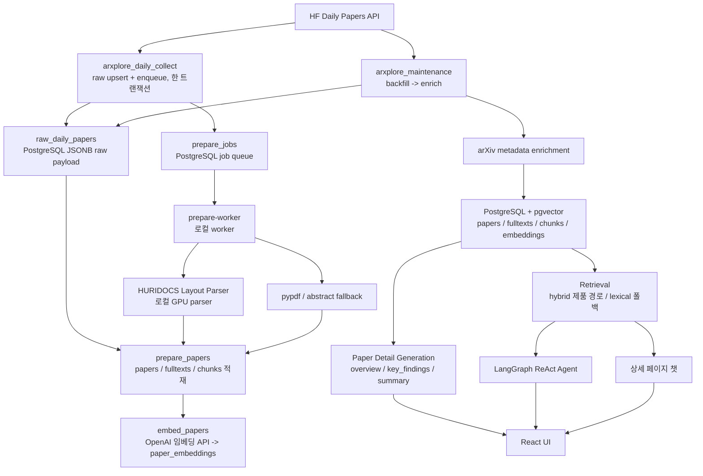
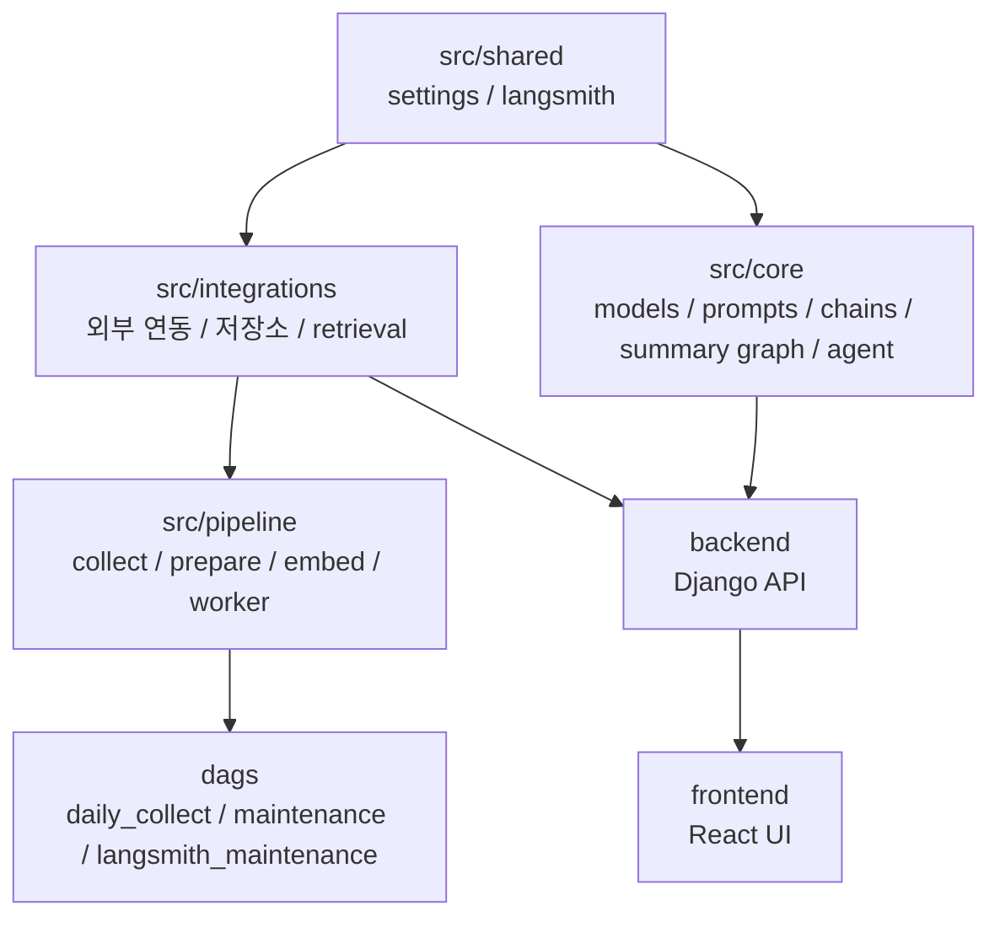

# ArXplore 시스템 아키텍처

## 1. 문서 목적

이 문서는 ArXplore의 현재 운영 구조와 모듈 경계를 코드 기준으로 설명한다. 목표 구조가 아니라 지금 코드가 실제로 하는 일을 적는다.

ArXplore는 `최신 AI 논문 수집 -> raw 저장 -> prepare queue 등록 -> 로컬 prepare/embedding -> retrieval -> 논문 상세 문서 / 에이전트 응답 -> UI` 흐름을 기준으로 한다. 수집 자동화와 무거운 파싱은 같은 런타임에 있지 않다. 서버 스택은 Airflow와 데이터 저장소를 운영하고, 로컬 PC는 Django/React 서비스, GPU parser, prepare worker를 실행한다.

## 2. 시스템 전경



- 수집 자동화는 서버 Airflow가 수행한다
- prepare와 embed는 로컬 worker가 수행하고, 결과는 서버 DB에 직접 적재한다
- GPU는 HURIDOCS 파서에만 쓴다. 임베딩은 OpenAI API(`text-embedding-3-large`, `dimensions=1536`)로 만든다

즉 "서버가 큐를 만든 뒤 로컬 worker가 이를 소비하는 분리형 구조"다. 서버에 GPU가 없어도 되고, 서버 DB를 공용 저장소로 유지할 수 있어 이 구조를 택했다.

## 3. 런타임 토폴로지

### 서버 런타임

`docker-compose.server.yml` 기준 컨테이너:

- `arxplore-postgres` (pgvector/pgvector:pg16)
- `arxplore-airflow-init`
- `arxplore-airflow-web`
- `arxplore-airflow-scheduler`
- `arxplore-airflow-dag-processor`

PostgreSQL(15432), Airflow(18080) 포트는 `TAILSCALE_SERVER_IP`에만 바인딩한다. Airflow는 SimpleAuthManager 사용자(`AIRFLOW_ADMIN_USER`)로 로그인한다.

서버 Airflow DAG는 3개다. 모두 `start_date`가 `Asia/Seoul`이라 cron은 KST 기준이다.

| DAG | 파일 | 스케줄 | 하는 일 |
| --- | --- | --- | --- |
| `arxplore_daily_collect` | `dags/daily_collect.py` | 매일 18:00 | 최신 HF Daily Papers raw 수집, 날짜를 `prepare_jobs`에 enqueue |
| `arxplore_maintenance` | `dags/maintenance.py` | 3시간마다 | 과거 raw backfill -> arXiv 메타데이터 enrich (backfill이 실패해도 enrich는 수행) |
| `arxplore_langsmith_maintenance` | `dags/langsmith_maintenance.py` | 매일 03:00 | 오래된 LangSmith trace 정리 (기본 14일 초과, `dry_run` 파라미터 지원) |

### 로컬 서비스 런타임

로컬 `docker-compose.yml`의 기본 서비스는 `arxplore-nginx`, `arxplore-django`다. nginx는 React 빌드를 서빙하고 API 경로만 Django로 프록시하며(SPA 경로는 `index.html`), 보안 헤더와 gzip을 붙인다. SSE 경로는 버퍼링을 끄고 읽기 제한을 300초로 둔다. Django는 gunicorn(gthread, 워커 4 × 스레드 8)으로 root가 아닌 `app` 사용자로 돌고, nginx는 django의 TCP healthcheck가 통과한 뒤 시작한다. 프론트엔드 수정용 Vite dev server(`arxplore-vite`)는 `dev` 프로필이다.

원격 서버 없이 웹만 띄울 때는 `local-db` 프로필의 `postgres-local`(pgvector/pgvector:pg16, `127.0.0.1:${SERVER_POSTGRES_PORT:-15432}`)을 함께 올린다. 같은 compose 기본 네트워크에 있으므로 django는 `PROD_POSTGRES_HOST=postgres-local:5432`로 접속한다. 수집 계층이 없으므로 이 모드의 DB는 비어 있다.

### 로컬 parser / worker 런타임

`parser` 프로필이 `arxplore-layout-parser`(HURIDOCS, GPU)와 `arxplore-prepare-worker`를 함께 올린다. worker는 파서 healthcheck가 통과한 뒤 시작한다. 코드에는 `LAYOUT_PARSER_BASE_URL` 기본값이 없지만, compose가 worker에 값이 비어 있으면 `http://layout-parser:5060`을 넣는다. 값이 끝내 비어 있으면 layout 단계를 건너뛰고 pypdf로 내려간다.

`src/pipeline/prepare_worker.py`가 `prepare_jobs`를 소비하는 공식 진입점이다. 시작할 때 스키마를 1회 확인(`ensure_schema`)한 뒤, `LISTEN/NOTIFY`로 새 잡을 기다리다가 `prepare -> embed`를 수행한다.

## 4. 모듈 구조



### `src/shared`

공용 설정과 tracing. `settings.py`는 PostgreSQL, parser, LangSmith, worker 설정을 로드하고, `host[:port]` 주소를 해석한다(`resolve_host_and_port`). `langsmith.py`는 단계별 trace metadata를 구성한다. 전체 환경 변수 목록은 루트 `.env.example`에 있다.

### `src/integrations`

- `paper_search.py`: HF Daily Papers와 arXiv 메타데이터 조회, 관련 논문 카드의 arXiv 외부 검색
- `raw_store.py`: HF Daily Papers raw payload(`raw_daily_papers`)와 backfill 진행 상태(`pipeline_state`)를 PostgreSQL JSONB로 저장
- `paper_repository.py`: `papers`, `paper_fulltexts`, `paper_chunks`, AI 결과 캐시 테이블 적재와 lexical 후보 조회
- `layout_parser_client.py`: HURIDOCS HTTP 호출과 응답 검증
- `fulltext_parser.py`, `pdf_parser/`: `layout -> pypdf -> abstract fallback` 파싱, 섹션 정리, `content_role` 판정, 청킹
- `prepare_job_repository.py`: `prepare_jobs` 큐의 enqueue, claim, heartbeat, stale reset, complete/fail, `LISTEN/NOTIFY`
- `embedding_client.py`: OpenAI 임베딩 API 호출
- `vector_repository.py`: `paper_embeddings` 저장, 누락 임베딩 조회, vector 후보 조회
- `paper_retriever.py`: lexical, vector, hybrid를 합치는 retrieval 인터페이스
- `db.py`: 프로세스별 PostgreSQL 연결 풀

생성자는 DDL을 실행하지 않는다. 스키마는 `scripts/migrate_schema.py`(또는 prepare-worker 시작 시 `ensure_schema`)가 만든다. DAG 태스크는 스키마가 이미 있다고 가정한다.

### `src/pipeline`

- `collect_papers.py`: 최신 수집, raw 저장과 prepare job enqueue(한 트랜잭션)
- `enrich_papers_metadata.py`: 저장된 논문의 arXiv 메타데이터 보강
- `prepare_papers.py`: raw 로드, parser 호출, 청크 생성, PostgreSQL 적재, 큐 잡 단위 처리
- `embed_papers.py`: 누락 청크 임베딩과 vector 적재
- `prepare_worker.py`: auto / backfill 모드 worker
- `cleanup_langsmith.py`: LangSmith trace 보존 기간 정리

### `src/core`

- `models.py`: `PaperRef`, `PaperDetailDocument`
- `prompts/`: overview, key_findings, summary, translation, agent, paper_chat 프롬프트
- `paper_chains.py`: 개요·핵심 포인트 생성 chain
- `summary_graph.py`: 섹션을 배경·방법·실험·한계 버킷으로 묶어 요약하는 LangGraph 상세 요약 그래프
- `translation_chains.py`: `build_summary`(상세 요약 진입점), `translate_chunk`(구현만 있고 호출하는 엔드포인트 없음)
- `agent/chatbot.py`, `agent/tools.py`: LangGraph ReAct 에이전트와 도구 2개
- `agent/retrieval.py`: 제품 검색 경로 선택(hybrid → lexical 폴백)
- `agent/paper_chat.py`: 상세 페이지 챗(논문 범위 검색 + 스트리밍)
- `agent/citations.py`: 도구 hit 레지스트리와 답변 인용 대조
- `tracing.py`: 도메인 레벨 trace 설정

### `dags`

Airflow가 파싱하는 DAG 정의만 둔다: `daily_collect.py`, `maintenance.py`, `langsmith_maintenance.py`.

### `backend`

- `backend/arxplore_web/`: Django 설정과 URL. DB 접속은 `src.shared`의 설정을 그대로 쓴다
- `backend/arxplore_web/`의 `INSTALLED_APPS`는 `staticfiles`와 `papers`뿐이다. auth·admin·sessions 앱과 Django ORM 모델·마이그레이션이 없고, CSRF 미들웨어는 켜 둔다
- `backend/papers/api_views.py`: bootstrap, 분석(POST), 요약, 상세 챗, 에이전트 API와 SSE
- `backend/papers/page_views.py`: React shell과 목록·상세 JSON endpoint
- `backend/papers/services.py`: LLM 호출(서버 `OPENAI_API_KEY`), AI 결과 캐싱(PostgreSQL 테이블 직접 관리), 관련 논문 합성, 입력 검증
- `backend/papers/ratelimit.py`: Django cache 기반 클라이언트 IP당 분당 rate limit

### `frontend`

- `frontend/src/pages/list/`: 논문 목록. 페이지·정렬·검색어는 URL 쿼리가 원본이다
- `frontend/src/pages/detail/`: 논문 상세. 개요·상세 요약 카드가 로딩·취소·오류 상태를 가진다
- `frontend/src/pages/assistant/`: 에이전트 채팅
- `frontend/src/helpers/`: HTTP(`ApiError`, 429 안내), SSE 클라이언트, 모달 접근성 훅

UI는 API만 소비하고 저장 구조나 외부 연동 코드를 직접 구현하지 않는다.

## 5. 데이터 흐름

1. `arxplore_daily_collect`가 HF Daily Papers 날짜 feed를 수집한다
2. raw payload를 PostgreSQL `raw_daily_papers`에 upsert한다(같은 날짜의 payload hash가 바뀌면 raw revision이 올라간다)
3. 같은 트랜잭션에서 수집 날짜를 `prepare_jobs`에 enqueue하고 `pg_notify`를 보낸다. 알림은 commit 뒤에 전달된다
4. 로컬 `prepare-worker`가 잡을 claim한다
5. `prepare_papers`가 raw payload에서 arXiv ID와 PDF 정보를 정리한다
6. HURIDOCS parser로 PDF를 파싱하고, 실패하면 pypdf, 최종적으로 초록 폴백을 쓴다
7. 섹션, quality metrics, artifacts, parser metadata를 구성하고 글자 수 기준(1,800자, 겹침 200자)으로 청킹한다
8. `papers`, `paper_fulltexts`, `paper_chunks`를 upsert한다(폴백 보호 규칙은 7절)
9. `embed_papers`가 누락된 청크 임베딩을 채운다(`references` 역할 청크는 임베딩하지 않는다)
10. `arxplore_maintenance`는 과거 raw 백필과 메타데이터 보강을 수행한다
11. retrieval 계층과 상세 문서 생성, 에이전트가 이 데이터를 소비한다

`raw_daily_papers`의 raw payload가 source of truth이고, 정제층(`papers`, `paper_fulltexts`, `paper_chunks`, `paper_embeddings`)은 raw에서 다시 만들 수 있는 읽기/검색 계층이다. 둘 다 같은 PostgreSQL에 있다.

## 6. 저장 구조

### PostgreSQL + pgvector

PostgreSQL이 유일한 저장소다. 애플리케이션 DB(`APP_POSTGRES_DB`) 하나에 raw payload, 파이프라인 상태, 정제 데이터, 벡터, 큐, AI 캐시, Django 테이블이 함께 있다. DDL 원본은 `PaperRepository.ensure_schema()`(`src/integrations/paper_repository.py`), `RawPaperStore.ensure_schema()`(`src/integrations/raw_store.py`), `PrepareJobRepository.ensure_schema()`(`src/integrations/prepare_job_repository.py`)다. `vector_repository.py`는 DDL이 없고 `paper_embeddings`를 읽고 쓰기만 한다.

| 테이블 | 키 | 주요 컬럼 | 인덱스·제약 |
| --- | --- | --- | --- |
| `raw_daily_papers` | `(source, date)` PK | `payload` JSONB(HF 응답 원본), `payload_hash`(키 순서와 무관한 sha256), `revision`(hash가 바뀔 때만 +1, 첫 저장 1), `fetched_count`, `collected_at` | PK만 |
| `pipeline_state` | `key` PK(`<pipeline>:<name>`) | `value` JSONB(backfill 커서, 마지막 처리 날짜, 마지막 실패), `updated_at` | PK만 |
| `papers` | `arxiv_id` PK | `title`, `authors` JSONB, `abstract`, `primary_category`, `categories` JSONB, `pdf_url`, `published_at`, `upvotes`, `github_url`, `source`, `title_abstract_vector` tsvector 생성 컬럼(제목 A + 초록 B, `english`) | `idx_papers_title_abstract_vector` GIN(`title_abstract_vector`) |
| `paper_fulltexts` | `arxiv_id` PK, FK -> `papers` (CASCADE) | `text`, `sections` JSONB, `source`(`layout_pdf` / `pdf` / `fallback_abstract`), `quality_metrics`, `artifacts`, `parser_metadata` JSONB, `content_hash` TEXT | PK만 |
| `paper_chunks` | `id` BIGSERIAL PK, FK `arxiv_id` -> `papers` (CASCADE) | `chunk_index`, `chunk_text`, `section_title`, `token_count`, `metadata` JSONB(`content_role` 포함), `chunk_vector` tsvector 생성 컬럼(청크 C, `english`) | `UNIQUE(arxiv_id, chunk_index)`, `idx_paper_chunks_chunk_vector` GIN(`chunk_vector`) |
| `paper_embeddings` | `chunk_id` PK, FK -> `paper_chunks` (CASCADE) | `embedding VECTOR(1536)`, `model_name` | `paper_embeddings_embedding_hnsw` HNSW(`embedding vector_cosine_ops`). pgvector 0.5.0 미만이면 경고만 남기고 생략 |
| `paper_ai_overviews` | `arxiv_id` PK, FK -> `papers` | `overview`, `key_findings` JSONB, `model`(기록용) | PK만 |
| `paper_ai_detailed_summaries` | `id` PK, FK `arxiv_id` -> `papers` | `model`, `summary` | `UNIQUE(arxiv_id, model)` |
| `prepare_jobs` | `id` BIGSERIAL PK | `mode`, `target_date`, `status`, `attempt_count`, `worker_id`, `claim_generation`, `claimed_at`, `heartbeat_at`, `next_attempt_at`, `raw_revision`, `pending_refresh`, `payload`/`result` JSONB, `error` | `UNIQUE(mode, target_date)`, `(mode, status, target_date)`, `(status, updated_at DESC)` |
| `topics`, `topic_papers`, `topic_documents` | - | 이전 토픽 계층의 잔재 | 현재 제품 경로에서 쓰지 않음 |

raw 저장 규칙:

- `save_daily_papers_response`는 `INSERT ... ON CONFLICT (source, date) DO UPDATE` 한 문장이다. `revision = CASE WHEN 기존 payload_hash = 새 payload_hash THEN 기존 revision ELSE 기존 revision + 1 END`로 계산하므로 동시 저장에서도 revision이 빠지거나 겹치지 않는다. 같은 hash면 payload는 그대로 두고 `collected_at`만 갱신한다
- 반환값 `changed`는 같은 문장의 CTE가 읽은 이전 hash와 저장된 hash를 비교한 값이다. 같은 날짜를 동시에 저장하는 경합에서는 True로 기울 수 있고, revision은 영향을 받지 않는다
- JSONB가 받지 않는 NUL 문자와 짝 없는 서로게이트는 hash 계산 전에 제거한다
- `run_collect_papers`는 HTTP 수집을 트랜잭션 밖에서 끝낸 뒤, 풀에서 빌린 연결 하나로 raw upsert와 `prepare_jobs` enqueue를 실행하고 한 번에 commit한다. enqueue가 실패하면 raw 저장도 롤백된다. `pg_notify`는 commit 시점에 전달되므로 worker가 깨어났을 때 raw는 항상 보인다

인덱스 관련 사실:

- lexical 후보는 질의 lexeme 중 하나라도 가진 행을 두 GIN 인덱스(`chunk_vector`, `title_abstract_vector`)로 각각 찾아 UNION한다. 후보마다 `title_abstract_vector || chunk_vector`에 원래 질의(모든 lexeme 요구)가 맞는지(`strict_match`)와 질의 lexeme 비율(`coverage`)을 계산한다. strict 행은 기존 `ts_rank_cd` 합 + 1.0, 나머지는 coverage 상위 `max(limit*20, 500)`개만 골라 `coverage × ts_rank_cd(OR 질의, 정규화 32)`(1 미만)로 점수를 매기므로, 긴 자연어 질의도 결과가 비지 않고 strict 행이 앞에 온다. 전체 질의 `ILIKE`는 strict 행에만 점수 보너스로 쓰고, `%`·`_`는 이스케이프한다
- 전체(논문 범위가 아닌) lexical·vector 검색은 SQL 안에서 논문마다 점수 상위 3청크만 남긴다(`row_number() over (partition by arxiv_id ...)`). retriever는 `max(limit*5, 30)`개를 요청하고, 마지막에 `_apply_paper_diversity`가 논문당 2청크를 우선한다
- 이전 `idx_paper_chunks_fts`(식 인덱스)는 `ensure_schema()`가 지운다
- 벡터 검색은 2단계다. 1단계는 `ORDER BY embedding <=> 질의 LIMIT max(limit*8, 80)`(논문 범위는 `max(limit*4, 40)`)로 HNSW를 타고(`model_name` 필터, 후보가 40개를 넘으면 트랜잭션 범위로 `hnsw.ef_search`를 올림), 2단계는 후보에만 섹션·`content_role` 보정과 `VECTOR_MIN_SIMILARITY` 하한, 논문당 3청크 상한을 적용해 정렬한다
- 논문 범위(`arxiv_id`) 벡터 검색은 HNSW 사후 필터가 결과를 잃을 수 있어 그 논문의 청크만 모아 정확 정렬한다
- 인덱스 사용 여부와 실행 시간은 `python scripts/explain_retrieval.py --query "..."`로 실제 DB에서 확인한다(`EXPLAIN (ANALYZE, BUFFERS)`)
- 기존 DB에 처음 `migrate_schema.py`를 돌리면 생성 컬럼 추가로 `papers`·`paper_chunks`를 다시 쓰고 HNSW를 빌드한다. prepare-worker를 멈춘 상태에서 실행한다
- 리포지토리 연결은 `src/integrations/db.py` 풀을 쓴다. 프로세스(gunicorn 워커)마다 첫 사용 시 만들어지고 최대 `POSTGRES_POOL_MAX`(기본 8)개, 고갈 시 `POSTGRES_POOL_TIMEOUT`(기본 30초)까지 기다린다. prepare-worker의 LISTEN은 전용 연결을 쓴다

## 7. prepare 큐 동작

`prepare_jobs`는 최종 사용자에게 보이지 않지만 서버 Airflow와 로컬 worker를 잇는 경계다.

- **enqueue**: `(mode, target_date)` 기준 upsert 후 `pg_notify('arxplore_prepare_jobs')`. `failed` 잡은 새 입력으로 보고 시도 횟수를 초기화해 `pending`으로 되돌린다. raw revision이 올라가면 `done` 잡도 `pending`으로 되돌리고, `processing` 중이면 `pending_refresh`로 표시한다
- **claim**: `FOR UPDATE SKIP LOCKED`로 `pending`이면서 재시도 대기 시간(`next_attempt_at`)이 지난 잡 1건을 `processing`으로 바꾸고, `attempt_count`와 `claim_generation`을 올려 `(job_id, worker_id, claim_generation)` 토큰을 돌려준다
- **heartbeat**: 논문 한 편을 처리하기 전마다 토큰이 유효한지 확인하며 `heartbeat_at`을 갱신한다. claim을 잃었으면 처리를 멈춘다
- **stale 판정**: 따로 도는 감시 프로세스는 없다. worker가 claim할 때 `COALESCE(heartbeat_at, claimed_at)`이 `PREPARE_JOB_STALE_SECONDS`(기본 900초)보다 오래된 `processing` 잡을 되돌린다. 시도 횟수가 남았으면 `pending`, 소진했으면 `failed`
- **complete**: 토큰이 일치할 때만 `done`으로 바꾼다. 처리 중 새 raw revision이 들어왔으면(`pending_refresh`) `done` 대신 `pending`으로 한 번 더 돌린다. 토큰이 맞지 않으면 아무것도 바꾸지 않는다
- **fail**: 토큰이 일치할 때만 반영한다. `attempt_count < PREPARE_JOB_MAX_ATTEMPTS`(기본 3)이면 `60초 × 2^(n-1)`(최대 1시간) 뒤 재시도하도록 `pending` + `next_attempt_at`, 소진했으면 `failed`
- **복구 스크립트**: `scripts/requeue_failed_prepare_jobs.py --since YYYY-MM-DD`(기본 dry-run, `--apply`로 반영)

prepare 단계의 보호 장치:

- 논문 단위 격리: 한 논문의 예외는 결과에 기록하고 나머지를 계속 처리한다. 큐 잡은 실패한 논문이 하나라도 있으면 fail → backoff → pending으로 재시도되고(`PREPARE_JOB_MAX_ATTEMPTS`), 저장이 끝난 논문은 재시도에서 unchanged로 건너뛴다. backfill은 실패가 있는 날짜에서 커서를 진행하지 않는다
- 멱등 재처리: source 순위 `layout_pdf > pdf > fallback_abstract`에서 하향 저장을 막고, 같은 source + 같은 `content_hash`면 저장을 건너뛴다. 청크 텍스트가 같으면 id와 임베딩을 보존한 채 메타데이터만 갱신한다. `--force`로 우회한다. 논문 단위 실패가 있는 날짜 잡은 backoff 후 재시도된다
- 임베딩 backlog: prepare 성공 여부와 상관없이 매 루프 `EMBED_BACKLOG_MAX_CHUNKS`(기본 400)까지 누락 임베딩을 채운다. backlog 오류는 worker를 멈추지 않는다

## 8. retrieval 계층

제품 경로는 `src/core/agent/retrieval.py`의 `retrieve_contexts`가 고른다. 에이전트 검색 도구와 상세 챗이 같은 함수를 쓴다.

| 경로 | 제품 사용 | 구현 |
| --- | --- | --- |
| hybrid | 기본 경로(`RETRIEVAL_MODE=hybrid`이고 질의 임베딩 키가 있을 때) | lexical + vector를 RRF(k=60)와 방법별·후보 품질 가중치로 합침. vector 결과가 있으면 lexical의 부분 일치(`strict_match=False`) 행은 빼고 합친다 |
| lexical | 폴백(키 없음, 임베딩 호출 `OpenAIError`, `RETRIEVAL_MODE=lexical`) | 제목(A)·초록(B)·청크(C) 가중 tsvector + `websearch_to_tsquery`/`plainto_tsquery` `ts_rank_cd`(strict 일치) 또는 OR 질의 × lexeme coverage(부분 일치), ILIKE 보너스, 섹션·`content_role` 가중, 질의 토큰 겹침 rerank, 참고문헌 유사 텍스트 필터, 논문 다양성, 인접 청크 병합 |
| vector | hybrid 구성 요소 | `paper_embeddings` 코사인 거리, 섹션·`content_role` 감점 후 rerank, `VECTOR_MIN_SIMILARITY` 하한 |

- 질의 임베딩 키는 서버 `OPENAI_API_KEY`다. `override_openai_runtime`으로 요청 범위 키를 넣으면(평가 스크립트) 그 키가 우선한다
- FTS 설정이 `english`라 한국어 질의는 lexical에서 거의 맞지 않는다. 키가 없어 lexical로 내려가면 한국어 검색 품질이 크게 떨어진다
- `references` 판정은 섹션 제목이 참고문헌 제목과 정확히 일치할 때만 참이다(`pdf_parser/section_roles.py`). 같은 규칙을 청커, retriever, SQL이 공유한다
- 상세 페이지 챗은 같은 경로를 `arxiv_id`로 한정해 호출하고, 결과가 비면 논문의 앞 청크로 대신한다(`retrieval_mode: "first_chunks"`)

## 9. 에이전트와 상세 챗

- **어시스턴트 페이지**: `src/core/agent/chatbot.py`의 LangGraph ReAct 에이전트(`create_react_agent`, `stream_mode=["messages", "updates"]`). Django `/papers/assistant/stream/`이 `StreamingHttpResponse` + `text/event-stream`으로 내보내고, React는 fetch ReadableStream으로 읽으며 중지 버튼으로 요청을 abort한다. 입력 검증과 서버 키 확인은 스트림 시작 전에 끝나서 400/503이 JSON으로 그대로 나간다
- **도구**(`src/core/agent/tools.py`)
  - `search_paper_chunks_tool`: `retrieve_contexts`(hybrid → lexical)로 5개 문맥을 찾아 `[번호] 제목 | arxiv_id | 섹션 | chunk_id` 헤더, 출처 URL, 본문으로 LLM에 넘기고 hit을 요청 범위 레지스트리에 기록한다
  - `get_trending_papers_tool`: 최근 논문 10편을 추천수 순으로 정렬해 돌려준다
- **가드레일**: `recursion_limit=AGENT_RECURSION_LIMIT`(기본 12). 초과하면 그때까지의 답에 단계 제한 안내를 붙여 끝낸다. 대화 이력은 최근 20개, 메시지당 4,000자로 자른다. 도구 결과는 지시가 아니라 데이터로 다루도록 프롬프트에 규칙이 있다
- **인용**: 답변 속 마크다운 링크를 도구 hit과 대조해 `citations` 이벤트(`in_answer`)를 한 번 보낸다. 도구 결과에 없는 링크는 서버 로그에 경고로 남긴다
- **상세 페이지 챗**: `src/core/agent/paper_chat.py`. 초록(1번 출처) + 질문으로 논문 안을 검색한 청크 최대 5개를 넣고 `/papers/<id>/chat/stream/`으로 스트리밍한다. 답변의 `[n]` 번호를 발췌문과 대조해 `citations`를 만든다. 비스트리밍 `/papers/<id>/chat/`도 남아 있다
- **접근 모델**: 계정·로그인·세션이 없고 모든 엔드포인트가 공개다. 개요·상세 요약은 캐시가 있으면 그대로, 없으면 서버 `OPENAI_API_KEY`로 생성해 캐시한다. 서버 키가 없으면 생성·챗·에이전트는 503이다. LLM 호출 엔드포인트 4개는 `RATE_LIMIT_LLM_PER_MINUTE`, `detail.json`은 `RATE_LIMIT_DETAIL_PER_MINUTE`로 클라이언트 IP당 제한되고 초과 시 429 + `Retry-After`를 돌려준다

## 10. `PaperDetailDocument` 계약

```python
class PaperRef(BaseModel):
    arxiv_id: str
    title: str
    authors: list[str]
    abstract: str
    pdf_url: str
    published_at: datetime | None = None
    upvotes: int = 0
    github_url: str | None = None
    github_stars: int | None = None
    citation_count: int | None = None


class PaperDetailDocument(BaseModel):
    arxiv_id: str
    title: str
    overview: str
    key_findings: list[str]
    generated_at: datetime
```

`PaperDetailDocument`는 생성 체인의 출력이자 UI 소비 계층의 입력이다. 필드 변경은 시스템 전반 변경으로 취급한다.

## 11. 추적

LangSmith trace metadata에 쓰는 stage 이름은 다음과 같다.

- 파이프라인(`src/pipeline/tracing.py`): `collect_papers`, `backfill_collect_papers`, `prepare_papers`, `backfill_prepare_papers`, `consume_prepare_queue`, `embed_papers`, `enrich_papers_metadata`
- 생성·챗(`src/core/tracing.py`): `paper_overview`, `paper_key_findings`(상세 분석 `analyze_paper_detail`이 두 체인을 호출), `summary`(상세 요약 그래프), `paper_chat`(상세 챗), `agent_chat`(에이전트)
- `translation`, `rag_answer`, `analyze_paper_detail`, `paper_detail_document`는 `build_analysis_trace_config`의 허용 목록에만 있고 현재 이 stage로 trace를 남기는 호출 경로는 없다

적재·큐 상태는 PostgreSQL에서 직접 확인한다. 예: `SELECT status, count(*) FROM prepare_jobs GROUP BY status;`, `SELECT count(*) FROM paper_chunks c LEFT JOIN paper_embeddings e ON e.chunk_id = c.id WHERE e.chunk_id IS NULL;`
